# *Documentacion de Reporte Hasley Forch*
 **Bueno, esta práctica fue sobre cómo hacer reportes, pero lo chulo es que lo hice de dos formas**

**Una usando PHP con HeidiSQL (que es como una base de datos pero más visual).**

**Y otra con C# en Visual Studio usando SQL Server**

## 1. ¿Qué herramientas usé?
- Visual Studio → para hacer el reporte en C# 

- PHP para la parte web.

- HeidiSQL para ver y trabajar con la base de datos de PHP, ya que es mas facil para php.

- SQL Server  para la base de datos del programa de escritorio en visual estudio.

- DataGridView  es donde se ven todos los datos en C#, es decir el crud.

### 2. Parte visual de PHP
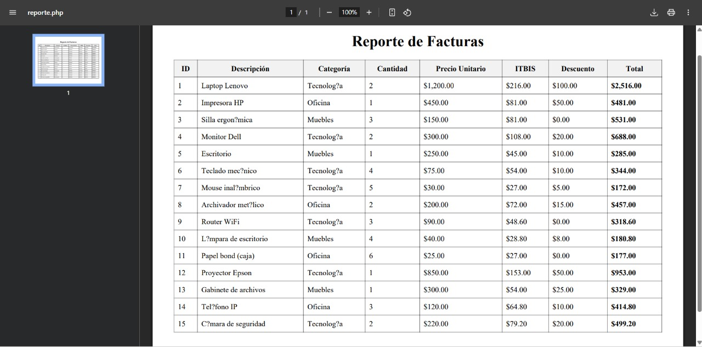

## 3. ¿Y qué hace mi sistema?
Pues el PHP básicamente lo que hace es que con un boton se abre el archivo pdf y al darle clik te muestra la tabla.
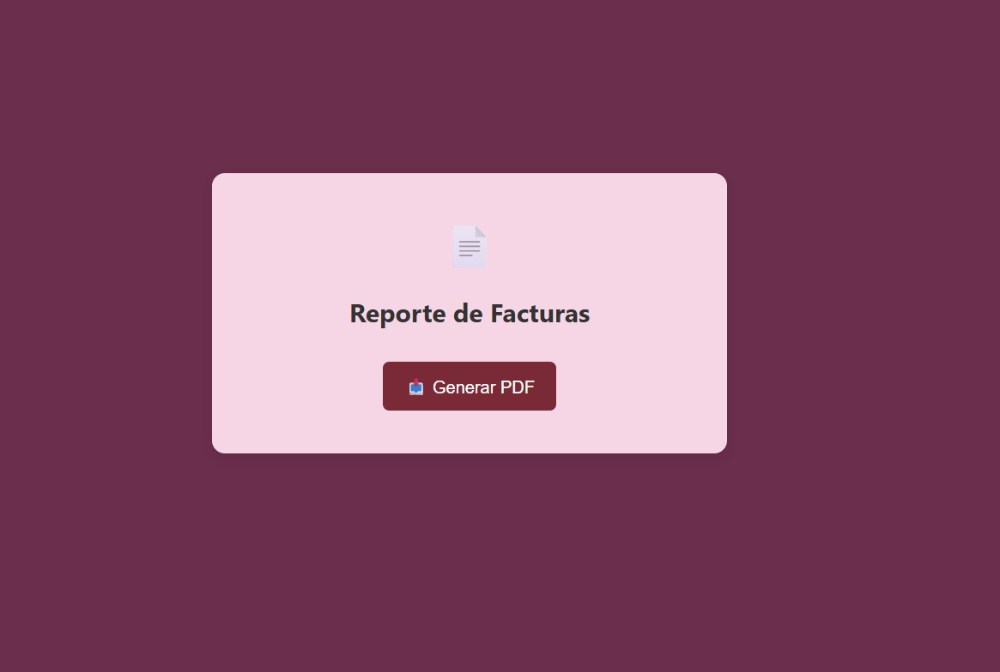
 En el boton Generar Facturas hara que te lleve hacia el archivo.

 ### 4. Explicacion Base de Datos>>Tabla
 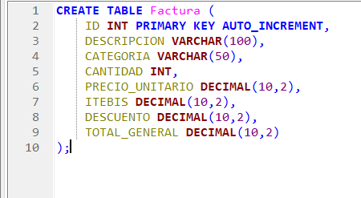
 ### Esta parte basicamente lo que dice es que cree la tabla factura dentro de la BD
 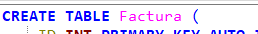

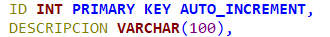

ID: es un número entero (INT).

PRIMARY KEY: es el identificador único de cada factura.

AUTO_INCREMENT: significa que ese número se va generando solo, uno tras otro (1, 2, 3.)

Ya lo otro son los tipos de datos que lleva la tabla.

# 5. Segunda Base de Datos SQL Server
Para crear la tabla en mi BD utilize un codigo tipico ya que era algo basico.

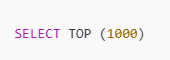

Esto basicamente quiere decir que me muestres solo los primeros 1000 registro o filas.

- Esta es la lista de columnas que tiene mi tabla, que llenan los campos. 

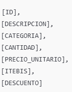

# 6. Reporte en c#

- Reporte 
Aqui basicamente lo que hace es presentar los datos de mi tabla.
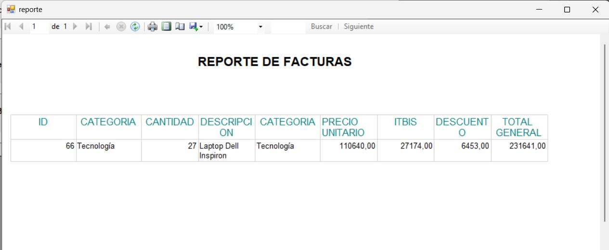
**Es un ReporViewer en un formulario que esta conectado con mi base de datos nueva que cree para hacer el reporte de facturas*

### 7. Reporte 
*En esta parte se divide en varias, ya que hay un crud, 2 form, el ReportViewer y por su puesto el codigo.*

*Como primer paso hice la interfaz de mi formulario donde va el Crud y los botones que me muestran que mi trabajo funciona.*

**Asi se ve mi Interfaz, un poco simple pero cumple con los requisitos**

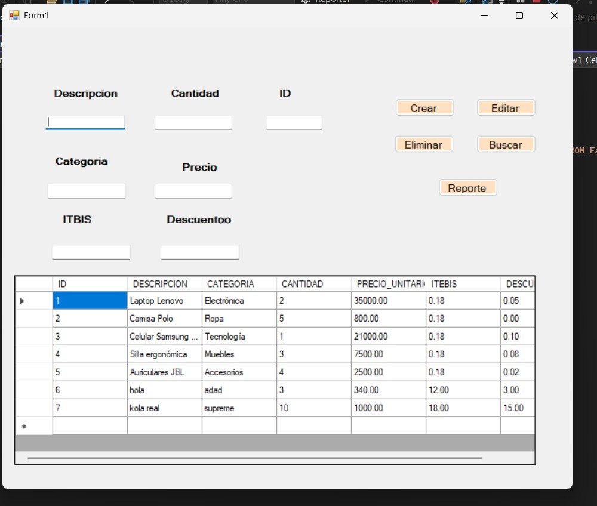

- Prueba de que los botones funcionan 
Eliminar Bbn, tambien se borra en la base de datos.
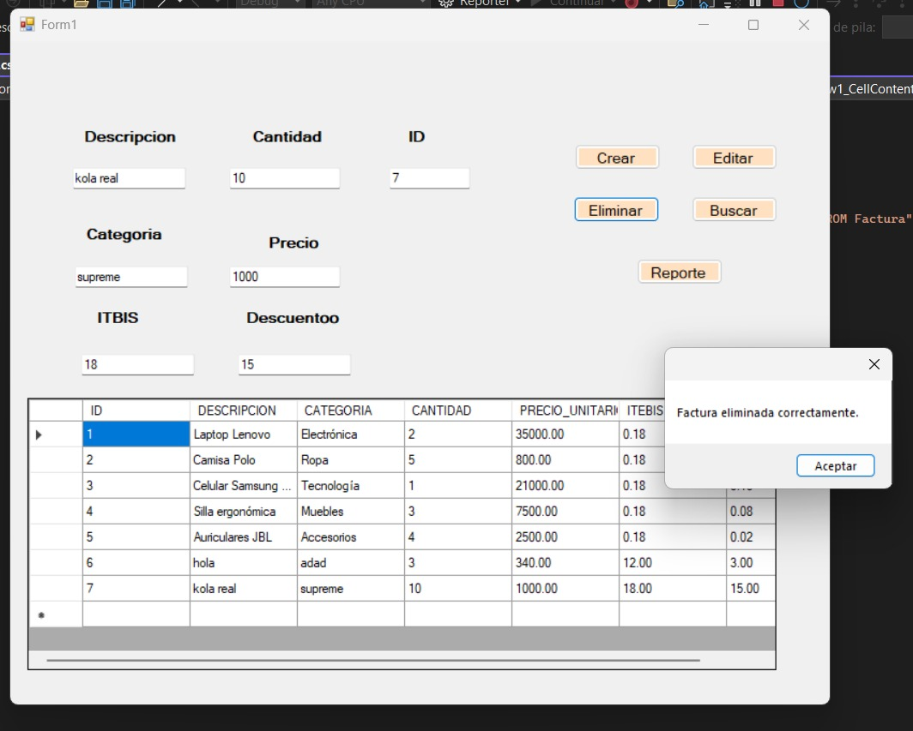

- Boton Crear
Este crea un nuevo Dato y lo guarda en la tabla.
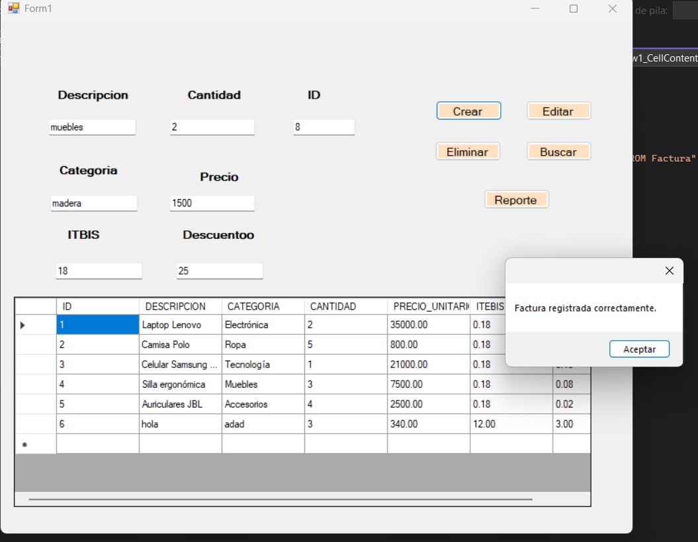

- Boton de Buscar, Este pues lo que hace es al poner el ID se llenen los campos q estan vacios y hace la funcion de buscar con  solo el ID.
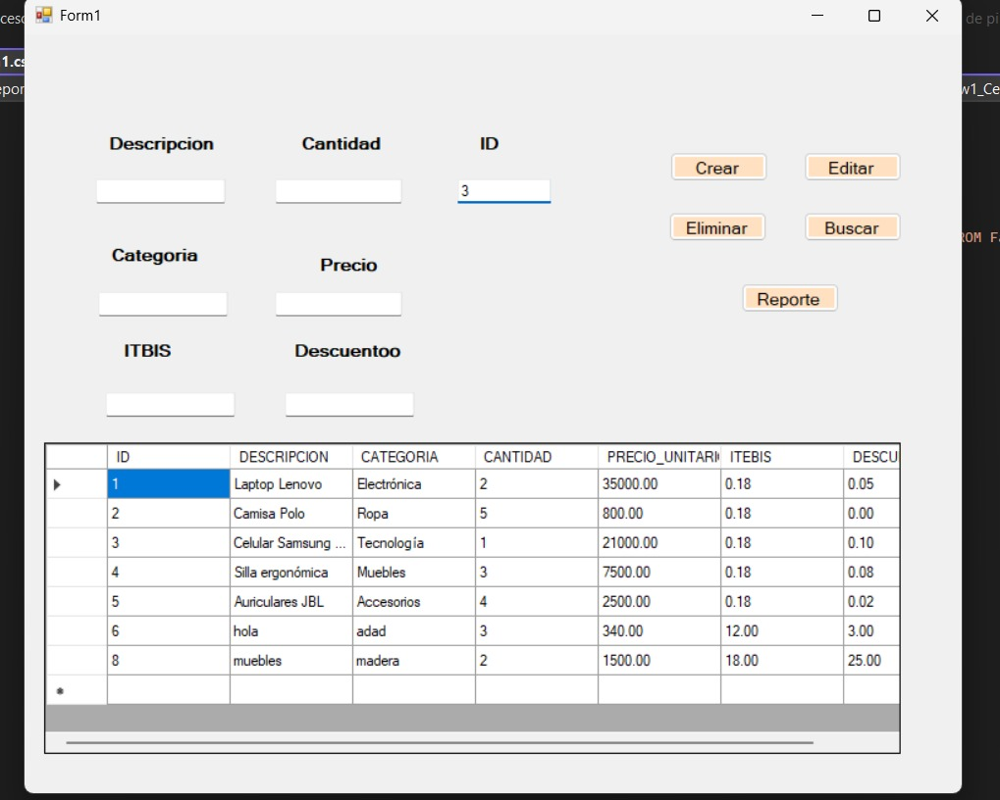
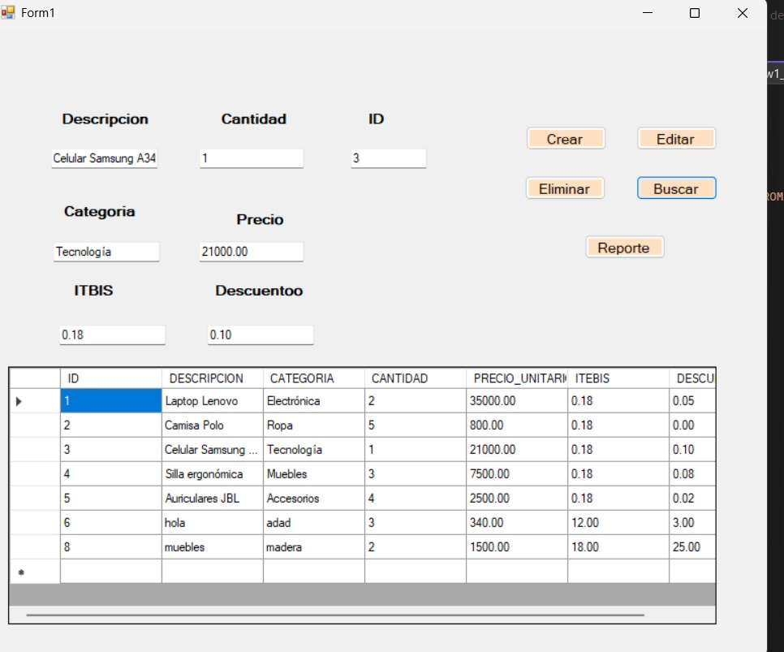

### Y pues el Boton de Reporte es el que muestra el ReportViewer.

# 1. Explicacion del codigo y su funcionalidad en el trabajo.
Cuando el trabajo empieza se encuentra 
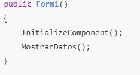

Se inicializa la ventana (InitializeComponent()).

Se llama a MostrarDatos() para cargar las facturas que ya están guardadas

**Método LimpiarCampos1()**
Este simplemente borra todo lo que escribiste en los campos para que puedas escribir otra cosa.

 **Botón para eliminar: Btn_Eliminar_Click**

1. Toma el ID que escribiste.

2. Borra la factura que tenga ese ID.

3. Te avisa si la eliminó o si ese ID no existe.

**Botón para editar:  Btn_Buscar_Click**
1. Escribes un ID y él busca esa factura.

2. Si la encuentra, llena los campos con los datos.

3. Si no existe, te dice que no se encontró nada.
